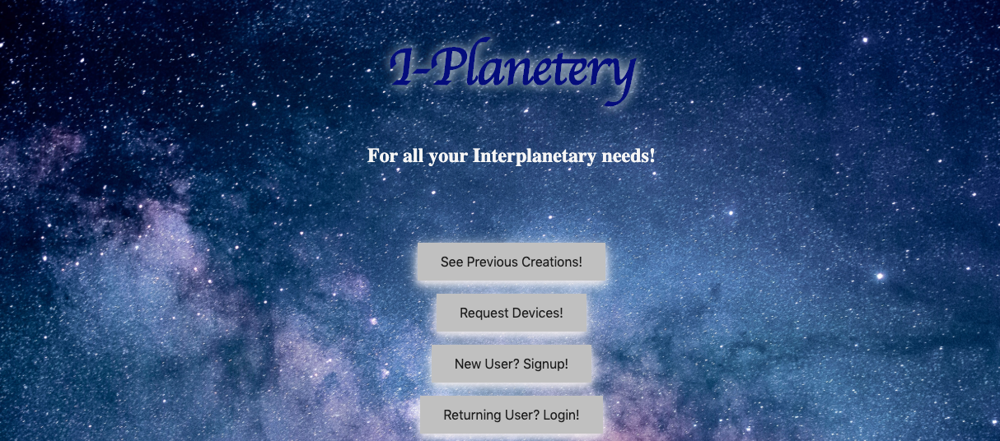

# Space Contractor!
# I-Planetary



## Motivation
This project is for the purpose of creating a website for the Space Explorer in us!

Buy futuristic Space Tech items!

## Proposal
[Contractor Proposal](proposal.md)


## Live Site
[Contractor V2](http://space-contractor-v2.herokuapp.com/)

## Built With
* [Python]()
* [Django]()

## Code Example
```
def signup(request):
    if request.method == 'POST':
        form = UserSignUpForm(request.POST)
        if form.is_valid():
            form.save()
            username = form.cleaned_data.get('username')
            messages.success(request, f'Your account has been created {username}! ')
            return redirect('index')
    else:
        form = UserSignUpForm()
    return render(request, 'users/signup.html', {'form': form})
```

## How to Use
Visit the Live Site! Test out Functionality and Enjoy!
OR
See Installation Instructions

## Installation
1. Clone repo to local device
` git clone https://github.com/RobotGyal/Space-Contractor-V2`
2. Install dependencies (see requirements.txt)
3. In command line run
`python3 manage.py runserver'

## Contribute
Please leave feedback, bugs, etc. to this project by leaving comments and issues!

## Credits
[Contractor Project](https://make-school-courses.github.io/BEW-1.2-Authentication-and-Associations/#/Projects/rubric)
